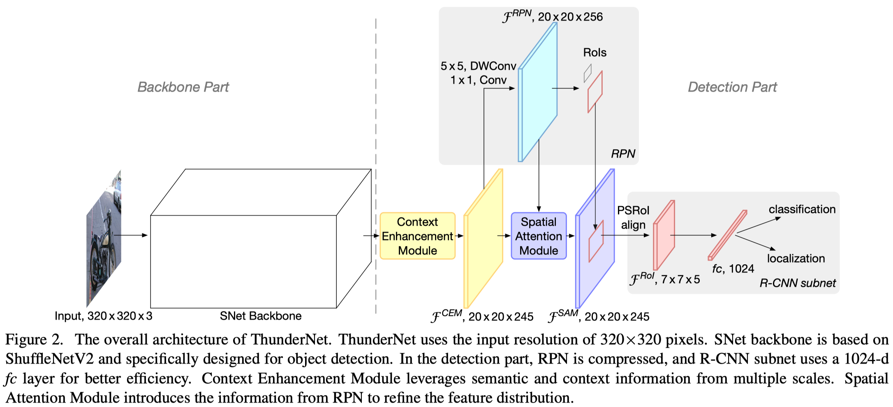

# ThunderNet: Towards Real-time Generic Object Detection on Mobile Devices

This repository contains the implementation of the paper:

[ThunderNet: Towards Real-time Generic Object Detection on Mobile Devices]()

[Zheng Qin](https://scholar.google.com/citations?user=DnHBAN0AAAAJ), [Zeming Li](https://scholar.google.com/citations?user=XdTqWS0AAAAJ), [Zhaoning Zhang](https://scholar.google.com/citations?user=E_J1q2AAAAAJ), [Yiping Bao](https://scholar.google.com/citations?user=EB9_W4kAAAAJ), [Gang Yu](https://scholar.google.com/citations?user=BJdigYsAAAAJ), Yuxing Peng, [Jian Sun](https://scholar.google.com/citations?user=ALVSZAYAAAAJ)

## Introduction

Real-time generic object detection on mobile platforms is a crucial but challenging computer vision task. Prior lightweight CNN-based detectors are inclined to use one-stage pipeline. In this paper, we investigate the effectiveness of two-stage detectors in real-time generic detection and propose a lightweight two-stage detector named ThunderNet. In the backbone part, we analyze the drawbacks in previous lightweight backbones and present a lightweight backbone designed for object detection. In the detection part, we exploit an extremely efficient RPN and detection head design. To generate more discriminative feature representation, we design two efficient architecture blocks, Context Enhancement Module and Spatial Attention Module. At last, we investigate the balance between the input resolution, the backbone, and the detection head. Benefit from the highly efficient backbone and detection part design, ThunderNet surpasses previous lightweight one-stage detectors with only 40% of the computational cost on PASCAL VOC and COCO benchmarks. Without bells and whistles, ThunderNet runs at 24.1 fps on an ARM-based device with 19.2 AP on COCO. To the best of our knowledge, this is the first real-time detector reported on ARM platforms.



## Requirements

mmdet==2.18.1
mmcv==1.3.17

## Installation

Please run the following commands for installation.

```bash
cd thundernet/PSROIAlign
sh ./build.sh
```

## Usage

### SNet Backbone

Please refer to `snet-training/README.md` for details.

### ThunderNet Detector

The training and testing scripts are modified from MMDetection. Please refer to [MMDetection](https://github.com/open-mmlab/mmdetection) for data orgainzation and more details.

**1. Training**

```shell
python train.py config/ThunderNet.py
```

**2. Testing**

```shell
python test.py config/ThunderNet.py weights/epoch_80.pth --eval bbox
```

## Results (COCO test-dev2017)

| input shape | bbox_mAP | bbox_mAP_50 | bbox_mAP_75 |
| :---: | :---: | :---: | :---: |
| 320*320 | 23.6 | 39.4 | 24.3 |


## Citation

If you find this repo useful in your research, please consider cite our work:

```bibtex
@inproceedings{ThunderNet,
    title={ThunderNet: Towards Real-time Generic Object Detection on Mobile Devices},
    author={Zheng Qin, Zeming Li, Zhaoning Zhang, Yiping Bao, Gang Yu, Yuxing Peng, Jian Sun},
    booktitle={Proceedings of the IEEE/CVF International Conference on Computer Vision},
    pages={6718-6727},
    year={2019}
}
```

## Acknowledgement

- [MMCV](https://github.com/open-mmlab/mmcv) & [MMDetection](https://github.com/open-mmlab/mmdetection).
- [ShuffleNetV2](https://github.com/megvii-model/ShuffleNet-Series/tree/master/ShuffleNetV2).
- [PSROIAlign Implementation](https://github.com/McDo/PSROIAlign-Multi-Batch-PyTorch).
- [Light-head RCNN](https://github.com/zengarden/light_head_rcnn)
